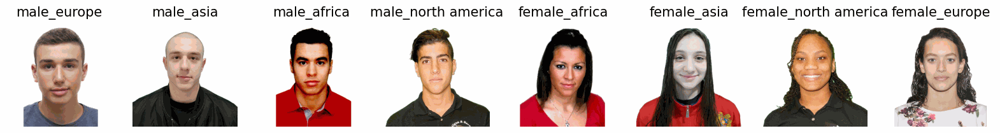
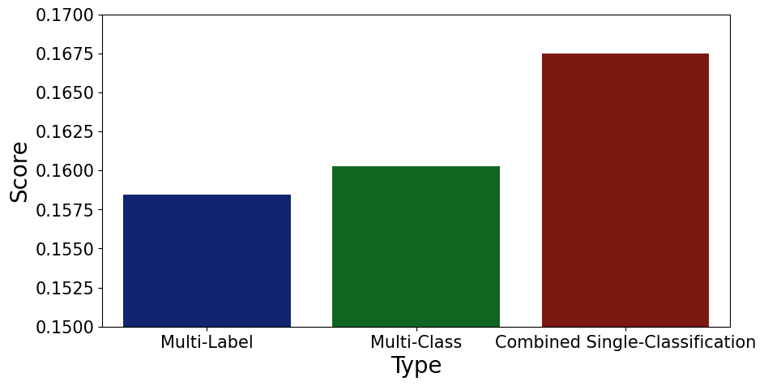

# shiny-bassoon

Building a face/ country classifier

## Summary
This [post](https://paul-mora.com/multi-output/classification/multi-label/python/Various-techniques-on-dealing-with-multi-output-classification/)/ repository evaluates different approaches when facing a multi-output within a classification problem. A multi-output describes a combination of several outputs put together. For example, a multi-output would describe a situation in which the classification model would not only have to predict whether the image shows a dog or a cat, but also which color the animal is.

There are two main approaches for this problem. We could either split this task into multiple single-classification models, in which each model outputs exactly one attribute. The alternative would be to use exactly one model which was designed to handle a multi-output in the first place. This post/ repository applies both methods on a scraped dataset in order to shed some light on the question when to go for which approach.

## Post
A more detailed explanation of the project as well as the entire discussion of the results can be found [here](https://paul-mora.com/multi-output/classification/multi-label/python/Various-techniques-on-dealing-with-multi-output-classification/)

### Data Preview
Instead of taking a pre-made image dataset, we scraped the meta information and images of the athletes participating in the water disciplines of the Tokyo 2020 Olympics. The decision for this website was made given the good data quality (e.g. all athletes were shot from the same angle) as well as the (okayish) amount of images of people.

### Performance
Within this post we apply several evaluation methods. For this preview we showcase the head-to-head comparison of the hamming loss of the different classifiers.

## Conclusion
These results lead to quite interesting conclusions. First of all, interaction effects are important. That was particularly visible when looking at the performance of the combined single-classification model. Secondly, whether to use multi-class or multi-label depends heavily what the objective of the classification task is. If we face a black and white scenario, in which a partially correct prediction is worth nothing, then we should use multi-class. If on the other hand, also partial correctness is useful, then we should opt for the multi-label approach. Last but not least. The multi-class algorithm scales the worst. When having a large multi-output space this approach seems likely to fail quicker than the multi-label, which scales considerably better.

## Contribution
Pull requests are welcome, though unlikely that I come back to that project.

## License
[MIT](https://choosealicense.com/licenses/mit/)
